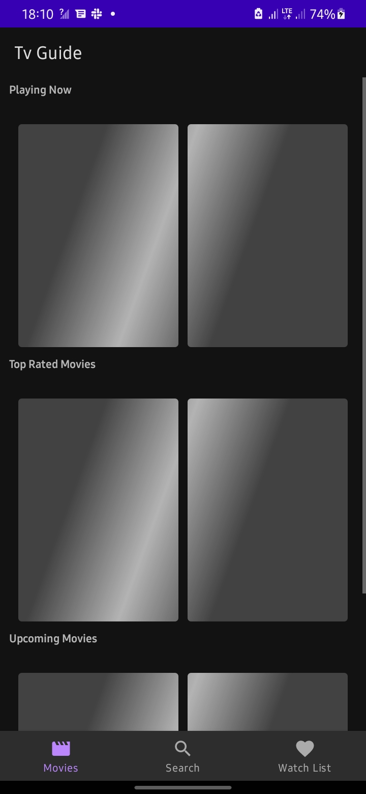

- This application consumes the [TMDB API](https://developers.themoviedb.org/3).

## Screenshots / App Demo

[]

## Features
- On the first fragment, the app displays top-rated, upcoming and movies now playing in horizontal recyclerviews.
- On clicking movie details, the app also displays the characters, and movies you'd like, based on the current movie.
- There is also a search movies feature.
- A user is also able to add movies to favorites database. 
- On the favorites' screen, swipe to delete is enabled.

## Technology Stack
- [Kotlin](https://kotlinlang.org/) - First class and official programming language for Android development.
- [Coroutines](https://kotlinlang.org/docs/reference/coroutines-overview.html) - To improve performance and overall user experience.
- [Android Architecture Components](https://developer.android.com/topic/libraries/architecture) - Collection of libraries that help you design robust, testable, and maintainable apps.
    - [LiveData](https://developer.android.com/topic/libraries/architecture/livedata) - Data objects that notify views when the underlying database changes.
    - [ViewModel](https://developer.android.com/topic/libraries/architecture/viewmodel) - Stores UI-related data that isn't destroyed on UI changes.
    - [ViewBinding](https://developer.android.com/topic/libraries/view-binding) - Generates a binding class for each XML layout file present in that module and allows you to more easily write code that interacts with views.
    - [Jetpack navigation](https://developer.android.com/guide/navigation) - Navigation component helps you implement navigation, from simple button clicks to more complex patterns, such as app bars and the navigation drawer.
- [Dagger-Hilt](https://dagger.dev/hilt/) For [Dependency injection (DI)](https://developer.android.com/training/dependency-injection)
- [Room database](https://developer.android.com/jetpack/androidx/releases/room) - Persistence library provides an abstraction layer over SQLite to allow for more robust database access while harnessing the full power of SQLite.
- [Material Components for Android](https://github.com/material-components/material-components-android) - Modular and customizable Material Design UI components for Android.
- [Coil](https://coil-kt.github.io/coil/) - An image loading library backed by Kotlin Coroutines.
- [Paging 3](https://developer.android.com/topic/libraries/architecture/paging/v3-overview) - The Paging library helps you load and display pages of data from a larger dataset from local storage or over network.
- [Shimmer Loading Effect](https://github.com/facebook/shimmer-android) - An easy, flexible way to add a shimmering effect to any view in an Android app. 
- [Retrofit](https://square.github.io/retrofit/) - To make network calls.

### ©️ License
[MIT][license] © [Kevin Mathenge][github]

[license]: /LICENSE
[github]: https://github.com/kev87ian
```
MIT License

Copyright (c) 2022 Kevin Mathenge

Permission is hereby granted, free of charge, to any person obtaining a copy
of this software and associated documentation files (the "Software"), to deal
in the Software without restriction, including without limitation the rights
to use, copy, modify, merge, publish, distribute, sublicense, and/or sell
copies of the Software, and to permit persons to whom the Software is
furnished to do so, subject to the following conditions:

The above copyright notice and this permission notice shall be included in all
copies or substantial portions of the Software.

THE SOFTWARE IS PROVIDED "AS IS", WITHOUT WARRANTY OF ANY KIND, EXPRESS OR
IMPLIED, INCLUDING BUT NOT LIMITED TO THE WARRANTIES OF MERCHANTABILITY,
FITNESS FOR A PARTICULAR PURPOSE AND NONINFRINGEMENT. IN NO EVENT SHALL THE
AUTHORS OR COPYRIGHT HOLDERS BE LIABLE FOR ANY CLAIM, DAMAGES OR OTHER
LIABILITY, WHETHER IN AN ACTION OF CONTRACT, TORT OR OTHERWISE, ARISING FROM,
OUT OF OR IN CONNECTION WITH THE SOFTWARE OR THE USE OR OTHER DEALINGS IN THE
SOFTWARE.
```
